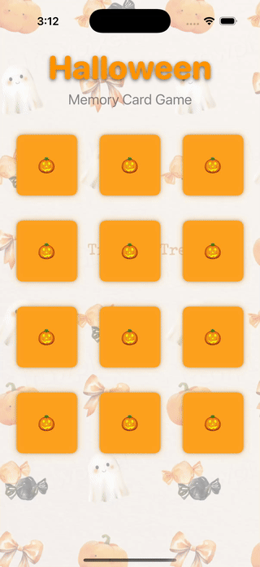

# Halloween Memory Card Game

## Assignment Details
- **Assignment**: Partner Lab 3
- **Group**: #4  
- **Partners**: Ari Lee & David Deng
- **Date**: November 11, 2025

## Features
- **MVVM Architecture**: Clean separation of code with Model-View-ViewModel pattern
- **Card Animation**: Playful scale animation with subtle glow effects
- **Game Logic**: Automatic match detection and game completion
- **Visual Feedback**: 
  - Matched cards show checkmark indicator with disabled state
  - Celebration overlay when game is completed
  - Orange glow hints for interactive cards
- **Halloween Theme**: Spooky-themed cards with pumpkin emoji card backs

## How to Play
1. Launch the app
2. Tap any card to reveal the Halloween image
3. Find matching pairs by remembering card positions
4. Matched pairs will be marked with a checkmark and become inactive
5. Complete all 6 pairs to win the game
6. Tap "Play Again" to restart with new random cards

## Technical Implementation

### MVVM Architecture
- **Model**: `CardModel` - Data structure for card state
- **View**: `ContentView`, `CardView` - SwiftUI views for UI presentation
- **ViewModel**: `MemoryGameViewModel` - Game rules and state management

### Animation Features
- **Card Reveal**: Pop animation with scale effect (0.78 → 1.0)
- **Interactive Hints**: Subtle orange glow on face-down cards
- **Match Celebration**: Scale and opacity animations for matched pairs
- **Game Completion**: Spring-animated overlay with dimmed background

### SwiftUI Components
- `LazyVGrid` for responsive card layout
- `@Published` properties for reactive state updates
- `@StateObject` for view model lifecycle management
- Custom animations with `interpolatingSpring`

## Setup Instructions
1. Clone the repository
2. Open `Lab3_AD.xcodeproj` in Xcode 15+
3. Build and run on iOS simulator or device (iOS 17+)

## Requirements Completed ✅
- **MVVM Architecture**: Clear separation between Model, View, and ViewModel
- **Custom Animation**: Pop scale animation with glow effects
- **Game Logic**: Complete matching game with win condition
- **Professional Code**: Well-commented, organized Swift code
- **Documentation**: Comprehensive README and code headers

## Video Presentation
[Link to your video explanation here]

## Image Credits
- Card images: Halloween icons from [Flaticon](https://www.flaticon.com)
- Background: [Trick or Treat Facebook Story Template](https://www.rawpixel.com/image/15980364/trick-treat-facebook-story-template) from Rawpixel
